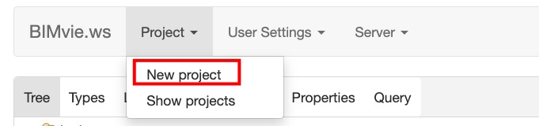
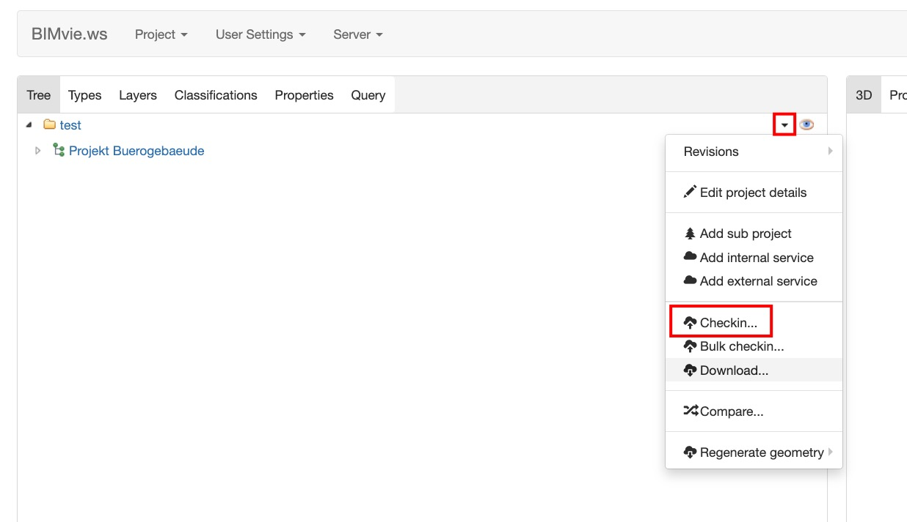
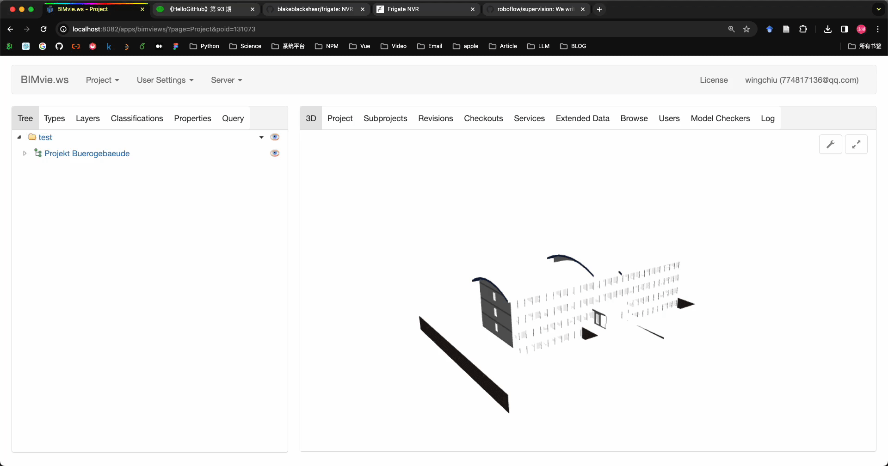

[BIMServer Github](https://github.com/opensourceBIM/BIMserver)

# 尝试方法

0. 安装java8.
1. 双击[bimserverjar](./bimserverjar-1.5.184.jar)。
2. 点击`start`.
3. 打开`localhost:8082`
4. 按照指导操作，在安装插件那一步反选掉所有的插件（如果你的网络不好），然后把本仓库下`plugins`文件夹下的所有插件jar包上传上去。
5. 等待安装。
6. 点击进入BIMvie.ws.
7. 点击`Project`下的`New project`.

8. 上传ifc格式的文件，本仓库在`ifc-examples`文件夹提供了几个测试文件([source](https://www.steptools.com/docs/stpfiles/ifc/))。

# 最终效果

使用blender打开的一个IFC格式文件效果如下：

但是同一个IFC格式文件使用BIMserver转化后，接着使用BIMviewer呈现出来的效果如下：

